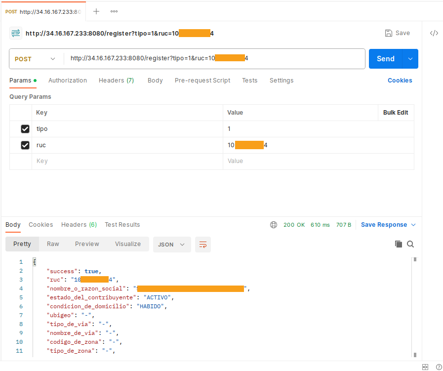

# GERONIMO

## OBJETIVO

Crear un "Tier-3 application" que pueda interfazar via web service en
GKE (API) y haga una invocación al web service JURIDICA para obterner
datos de personas jurídicas y cuando los resultados sean correctos
almacenarlos en un "MongoDB".

## TIER 3: DATABASE

### MONGODB

1) Crear VM en Compute Engine con debian 11.8, para este caso estoy
usando E2-micro (shared), 1G RAM, 10GB SSD, más que suficiente. IP
estático en interfaz interna y firewall bloquea todo, sólo permite
conexiones a través de interfaz interna dentro de la misma red local,
del mismo proyecto.

2) Instalando mongo

```
curl -fsSL https://pgp.mongodb.com/server-7.0.asc | sudo gpg -o /usr/share/keyrings/mongodb-server-7.0.gpg --dearmor

echo "deb [ signed-by=/usr/share/keyrings/mongodb-server-7.0.gpg ] http://repo.mongodb.org/apt/debian bullseye/mongodb-org/7.0 main" | sudo tee /etc/apt/sources.list.d/mongodb-org-7.0.list

apt-get update

apt-get install mongodb-org
```

- Editar /etc/mongod.conf -> sección network intefaces -> editar bindIP
  para aceptar llamadas internas de servicios del mismo proyecto.

```
service mongod start
```

- Crear usuario y password para autenticación interna con db.createUser.
- Crear usuarios necesarios, admin y usuario para la BD específica.
- Editar /etc/mongod.conf -> descomentar security -> authorization: enabled

```
service mongod restart
```

3) Nombre de la BD: geronimo

## TIER 2: API

### GKE

1) Crear el proyecto y poner las dependencias en package.json y ejecutar

```
npm install
```

2) Personalizar/configurar datos en app.json

3) Crear app.js y poner el código de la API, ejecutando en el contenedor
desde un servidor en la misma red privada se puede probar ejecutando
curl de la forma:

```
curl -d '{"tipo": "1", "ruc": "101111111164"}' -H 'Content-Type: application/json' http://<YOUR_GKE_IP>:8080/register
```

4) Crear Dockerfile y .dockerignore, según lo ya conocido y construir la
imagen 18-alpine debido que estoy usando nodejs 18.7.0, ejecutar los
siguientes comandos en modo root, para generar la imagen, probar el
contenedor y publicarlo en su repositorio docker.

```
docker build -t <dockerusr>/geronimo-docker-image-js .
docker image ls
```

```
docker run --name geronimo-docker-image-js -p :8080 -d <dockerusr>/geronimo-docker-image-js
docker ps -a
```

```
docker login -u <dockerusr>
docker push <dockerusr>/geronimo-docker-image-js
```

5) Crear kubernetes cluster, conectar al proyecto y luego conectar al
cluster para desplegar el microservicio de la imagen generada en el paso
3 y exponerlo con balanceador de carga para que pueda ser consumido, no
olvidar tu VPC :). En mi caso lo pongo como ejemplo a continuación:

```
gcloud container clusters get-credentials geronimo-cluster --zone us-west4-b --project nike-challenge
kubectl create deployment geronimo-docker-image-js --image=nmagko/geronimo-docker-image-js
kubectl expose deployment geronimo-docker-image-js --type=LoadBalancer --port=8080
```

La imagen está disponible en docker hub, sin embargo está pre
configurada con las redes internas creadas para la prueba del reto
técnico, que también es temporal, lo mejor es que construya tu propia
imagen con los pasos aquí descritos, a fin de cuentas el código fuente
está en el github.

Para las pruebas puedes usar POSTMAM o CURL.

### Con POSTMAN

puedes validar 2 pruebas GET y POST, GET para validar que la API está
arriba y es usado por el loadbalancer internamente para ver
disponibilidad y subir instancias en caso caiga una. Con POST se hace la
llamada a la API para la consulta de RUC.

Llamada GET

```
Postman GET: http://34.16.167.233:8080/
```

Respuesta:

```json
{"success":true,"message":"API up and running"}
```

Llamada POST

```
Postman POST: http://34.16.167.233:8080/register
Postman KEY: tipo, VALUE: 1
Postman KEY: ruc,  VALUE: 10297205264
```

Respuesta:

```json
{"success": true, "ruc": "10297205264", "nombre_o_razon_social": "SALAS PUMACAYO VICTOR CLODOALDO", "estado_del_contribuyente": "ACTIVO", "condicion_de_domicilio": "HABIDO", "ubigeo": "-", "tipo_de_via": "-", "nombre_de_via": "-", "codigo_de_zona": "-", "tipo_de_zona": "-", "numero": "-", "interior": "-", "lote": "-", "dpto": "-", "manzana": "-", "kilometro": "-", "departamento": "-", "provincia": "-", "distrito": "-", "direccion": "", "direccion_completa": " - - - -", "ultima_actualizacion": "2023-12-03 13:42:19"}
```

Captura de pantalla Postman:



### Con CURL

Llamada GET

```
Curl GET: curl http://34.16.167.233:8080
```

Respuesta:

```json
{"success":true,"message":"API up and running"}
```

Llamada POST

```
Curl POST: curl -d '{"tipo": "1", "ruc": "10297205264"}' -H 'Content-Type: application/json' http://34.16.167.233:8080/register
```
Respuesta:

```json
{"success": true, "ruc": "10297205264", "nombre_o_razon_social": "SALAS PUMACAYO VICTOR CLODOALDO", "estado_del_contribuyente": "ACTIVO", "condicion_de_domicilio": "HABIDO", "ubigeo": "-", "tipo_de_via": "-", "nombre_de_via": "-", "codigo_de_zona": "-", "tipo_de_zona": "-", "numero": "-", "interior": "-", "lote": "-", "dpto": "-", "manzana": "-", "kilometro": "-", "departamento": "-", "provincia": "-", "distrito": "-", "direccion": "", "direccion_completa": " - - - -", "ultima_actualizacion": "2023-12-03 13:42:19"}
```

## TIER 1: FRONT-END

Ver aplicacion geronimoapp en:

```
https://github.com/nmagko/geronimoapp
```
