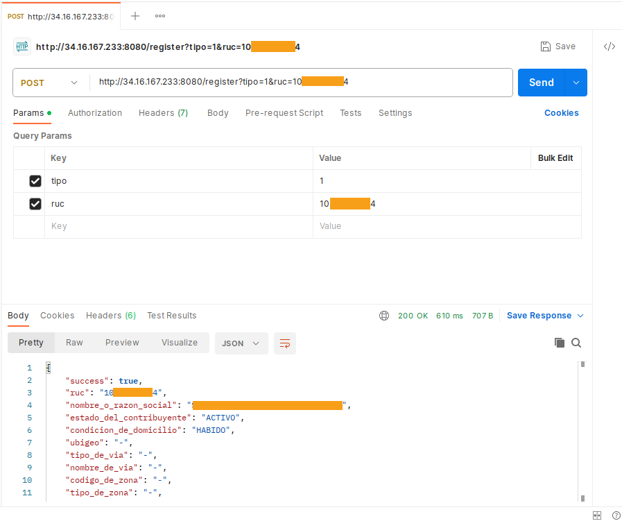

# GERONIMO

## GOAL

Create a "Tier-3 application" with a web service interface in GKE (API)
by calling the Juridica web service to get legal data entities. When it
gets results, save them in "MongoDB."

## TIER 3: DATABASE

### MONGODB

1) Create a VM in Compute Engine with Debian 11.8, E2-micro (shared), 1G
   RAM, and 10GB SSD. Static IP on the internal interface and the
   firewall blocks everything and only allows connections through the
   internal interface within the same local network of the same project.

2) Installing mongo

```
curl -fsSL https://pgp.mongodb.com/server-7.0.asc | sudo gpg -o /usr/share/keyrings/mongodb-server-7.0.gpg --dearmor

echo "deb [ signed-by=/usr/share/keyrings/mongodb-server-7.0.gpg ] http://repo.mongodb.org/apt/debian bullseye/mongodb-org/7.0 main" | sudo tee /etc/apt/sources.list.d/mongodb-org-7.0.list

apt-get update

apt-get install mongodb-org
```

- Change the /etc/mongod.conf file -> network intefaces section ->
  bindIP to accept calls from servers of the same GCP project.

```
service mongod start
```

- Create a user and password for authentication with db.createUser.
- Create admin and normal users for the database as needed.
- Change the /etc/mongod.conf file -> uncomment security ->
  authorization: enabled

```
service mongod restart
```

3) DB name: geronimo

## TIER 2: API

### GKE

1) Create the project, put dependencies on package.json, and run:

```
npm install
```

2) Customize your data in app.json

3) Create app.js with the API code, and you can run the program and test
it with curl from another server in the same network of the same
project:

```
curl -d '{"tipo": "1", "ruc": "101111111164"}' -H 'Content-Type: application/json' http://<YOUR_GKE_IP>:8080/register
```

4) Create Dockerfile and .dockerignore and build the image 18-alpine
cause I'm using nodejs 18.7.0, execute the following commands as root to
create the image, test the container, and publish on your docker
repository.

```
docker build -t <dockerusr>/geronimo-docker-image-js .
docker image ls
```

```
docker run --name geronimo-docker-image-js -p :8080 -d <dockerusr>/geronimo-docker-image-js
docker ps -a
```

```
docker login -u <dockerusr>
docker push <dockerusr>/geronimo-docker-image-js
```

5) Create a Kubernetes cluster, connect to the project, and then connect
to the cluster to deploy the microservice of the image generated in step
3. Expose it with a load balancer to be consumed. Do not forget your VPC
:). In my case, I put it as an example below:

```
gcloud container clusters get-credentials geronimo-cluster --zone us-west4-b --project nike-challenge
kubectl create deployment geronimo-docker-image-js --image=nmagko/geronimo-docker-image-js
kubectl expose deployment geronimo-docker-image-js --type=LoadBalancer --port=8080
```

The image is available on the docker hub, but, it is pre configured with
the internal networks created for the technical challenge, which is also
temporary, it is best to build your own image with the steps described
here, ultimately the source code It's on Git Hub.

You can use POSTMAN or CURL for testing.

The application was published for seven days on the IP used as an example.

### POSTMAN

GET

```
Postman GET: http://34.16.167.233:8080/
```

Answer:

```json
{"success":true,"message":"API up and running"}
```

POST

```
Postman POST: http://34.16.167.233:8080/register
Postman KEY: tipo, VALUE: 1
Postman KEY: ruc,  VALUE: 10777777774
```

Answer:

```json
{"success": true, "ruc": "10777777774", "nombre_o_razon_social": "XXXXX WWW YYYY ZZZZZZ", "estado_del_contribuyente": "ACTIVO", "condicion_de_domicilio": "HABIDO", "ubigeo": "-", "tipo_de_via": "-", "nombre_de_via": "-", "codigo_de_zona": "-", "tipo_de_zona": "-", "numero": "-", "interior": "-", "lote": "-", "dpto": "-", "manzana": "-", "kilometro": "-", "departamento": "-", "provincia": "-", "distrito": "-", "direccion": "", "direccion_completa": " - - - -", "ultima_actualizacion": "2023-12-03 13:42:19"}
```

Postman screenshot:



### CURL

GET

```
Curl GET: curl http://34.16.167.233:8080
```

Answer:

```json
{"success":true,"message":"API up and running"}
```

POST

```
Curl POST: curl -d '{"tipo": "1", "ruc": "10777777774"}' -H 'Content-Type: application/json' http://34.16.167.233:8080/register
```

Answer:

```json
{"success": true, "ruc": "10777777774", "nombre_o_razon_social": "XXXXX WWW YYYY ZZZZZZ", "estado_del_contribuyente": "ACTIVO", "condicion_de_domicilio": "HABIDO", "ubigeo": "-", "tipo_de_via": "-", "nombre_de_via": "-", "codigo_de_zona": "-", "tipo_de_zona": "-", "numero": "-", "interior": "-", "lote": "-", "dpto": "-", "manzana": "-", "kilometro": "-", "departamento": "-", "provincia": "-", "distrito": "-", "direccion": "", "direccion_completa": " - - - -", "ultima_actualizacion": "2023-12-03 13:42:19"}
```

## TIER 1: FRONT-END

See the related application geronimoapp on:

```
https://github.com/nmagko/geronimoapp
```
